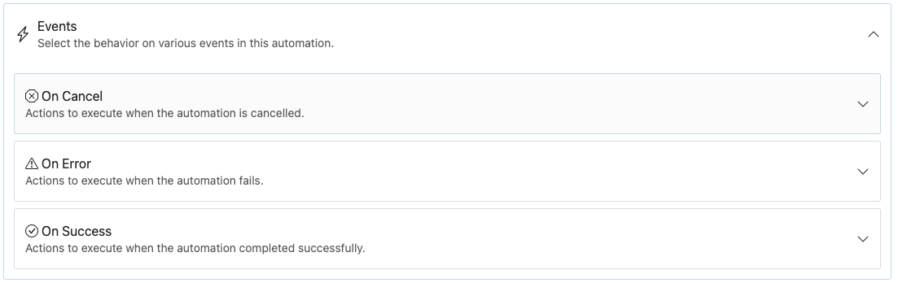

# Automations Tab

The **Automations** tab is one of the most essential features in SyncEngine, enabling you to create and manage powerful workflows. This tab allows you to design automations tailored to your needs by specifying inputs, data sources, and tasks.

___

## Creating a New Automation

When creating a new automation, you will need to provide the following details:

- **Name**: Used for your reference to track and identify the automation’s purpose.
- **Description**: An optional field to provide additional context or notes about the automation.
- **Endpoint**: A required field that serves as the trigger point for the automation. You will need to call this endpoint to start the automation.

## Configuring the Automation

Once the automation is created, you’ll be presented with various options. While the interface offers immense flexibility, it can initially seem overwhelming. Here's how to get started:

### 1. Select the Data Source
Choose the source of data for the automation by selecting one of the following options:

- **Request**: Use this option if you want to send all required data to the automation's endpoint when it is triggered.
- **Retrieve**: Use this option if the automation should fetch data from an external source. After selecting this option, a default **retrieve** task will appear. You can configure this task to define the external source.

### 2. Add Actions
After defining the data source, you can:
- Add individual tasks that define the specific actions or operations to be performed.
- Create flows and routines to organize tasks logically and control the execution order.

[Tasks](tasks.md), [routines](routines.md) and [Flows](flows.md) can include data processing, conditional branching, integrations with external services, and more.

### 3. Test and Preview
At any point, you can use SyncEngine’s **Previewer** to test or inspect the automation. The Previewer provides insights into how the automation functions and what outputs it produces. To access the Previewer, press the play button as shown in the interface.

### 4. Events Tab

The **Events** tab in SyncEngine’s Automations is where you define what actions should be taken after an automation has finished running. This tab ensures that appropriate follow-up actions are performed based on the outcome of the automation, whether it has run successfully or encountered errors.

#### Purpose of the Events Tab
After an automation completes its tasks, the system consults the **Events** tab to determine the next steps. This allows you to create automated responses and workflows tailored to the automation’s final state.

#### ^^Key Features of the Events tab^^

**Conditional Tasks Based on Automation State**. The Events tab lets you define separate actions for:

- **On Success Runs**: Tasks to perform when the automation completes successfully.
- **On Error**: Tasks to handle errors or unexpected outcomes.
- **On Cancel**: If there is no data, or the data does not meet the requirements. 

**Multi-Task Capability**. You can configure multiple tasks for each state, enabling complex and diverse workflows. For example:

- Sending notifications.
- Triggering follow-up automations.
- Logging outcomes in external systems.

#### Example Use Case
Consider an automation that imports products from an ERP system to e-commerce software:

- **On Success Run**: Update the inventory dashboard and notify the operations team.
- **On Error**: Automatically email the product owner with details about the error and log the failure in the error tracking system.

___

## Benefits of the Automations Tab
- **Flexibility**: Build custom workflows that adapt to your needs.
- **Scalability**: Handle complex integrations and large-scale tasks with ease.
- **User-Friendly Testing**: The Previewer simplifies debugging and ensures your automation works as expected.

## Tips for Effective Automation
- Use meaningful names and descriptions to keep your automations organized.
- Start small: Begin with basic tasks before incorporating advanced flows and integrations.
- Leverage the Previewer frequently to test changes incrementally.
- In the Previewer you can use the "Dry run" function, this will NOT send data to external sources.

## Additional Resources
For detailed guides on specific tasks or troubleshooting common issues, visit the [SyncEngine Documentation](https://docs.syncengine.io) or reach out to our [Support Team](mailto:info@syncengine.io).

---

Start exploring the **Automations** tab today and unlock the potential of SyncEngine’s workflow automation capabilities!