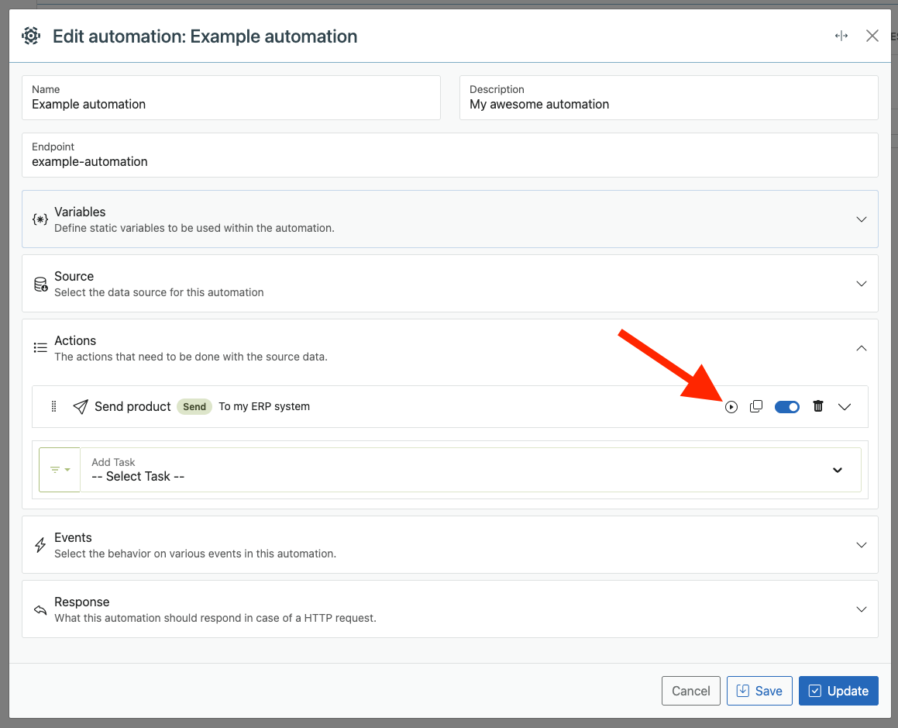

# Dashboard Overview

The **SyncEngine Dashboard** is your command center, where you can monitor automations, view logs, and inspect the health of your system.

From here, you can track every executed flow, view recent runs, and analyze results with detailed trace information.

---

## Overview Section

The top section of the dashboard provides a quick snapshot of your system’s activity:

- **Total Runs** – The number of completed automation executions.
- **Last Run** – A timestamp showing when the most recent automation executed.
- **System Health** – Indicates the stability of your recent runs.

This information updates automatically as new automations are executed.

---

## Detailed Logs

SyncEngine features an **extremely detailed logging system**, allowing you to retrace every step of your automations.

Each log entry includes:

- **Flow Name** – The automation that was executed.
- **Start & End Times** – When execution began and finished.
- **Execution Status** – Success, Warning, or Error.
- **Triggered By** – Indicates what event or source triggered the run.
- **Responses** – Shows all the repsonses from external services if there are any.
- **Task Trace** – A step-by-step record of every task performed during execution.

Logs are filterable and searchable, enabling quick debugging and auditing of complex automation workflows.

> **Tip:** Logs for preview (test) runs do not appear in the main dashboard. Only full production runs are shown here.

---

## The Preview Function

The **Preview Function** is one of SyncEngine’s most powerful developer tools.  
It allows you to **test and simulate automations safely**, either in a *Dry Run (safe)* mode or a *Live Run* mode, all without leaving the editor.

To open the Previewer, navigate to any task within an automation and click the **Play** ▶ button (as shown above).  
This opens a preview window where you can inspect and modify input data, set variables, and execute the automation in a controlled environment.

---

### Preview Modes

Inside the Previewer, you always have **two run options**:

| Button | Mode | Description |
|---------|------|-------------|
| **Dry Run (Safe)** | **Simulation Mode** | Executes the automation while skipping all **Send** tasks, so **no live data** is changed. It still performs **Retrieve** tasks, allowing you to fetch real data for realistic testing. |
| **Run** | **Full Execution Mode** | Executes the automation completely, including **Send** tasks. This may push or update live data, so use with caution. Ideal for verifying full end-to-end flows. |

---

### How It Works

- SyncEngine loads your selected flow and its routines.
- You can manually edit **input data** and **variables** in the preview window to test specific scenarios.
- Once configured, you can execute either a **Dry Run (safe)** or a **Run** depending on your testing needs.
- The preview results show exactly how each task transforms and passes data to the next step.

This gives you full insight into your automation logic, without needing to execute a full production run.

---

### Example Use Case

Imagine you’re testing a flow that retrieves user data, filters active users, and sends updates to your CRM.

In Preview Mode:

- **Dry Run (Safe):**  
  Retrieves real users, applies filters, and shows you the final dataset, but skips sending to the CRM.

- **Run:**  
  Retrieves, filters, and **sends** the data, allowing you to test follow-up tasks and confirm your API output.

---

### Custom Test Data and Variables

Inside the Previewer, you can manually define or override data fields, variable values, or environmental inputs.  
This is especially useful for:

- Testing edge cases without modifying live data
- Debugging transformations for specific records
- Validating conditional logic or mappings

SyncEngine will use your provided data instead of retrieving it from external connections, allowing total control during testing.

---

###  Summary

| Feature | Dry Run (Safe) | Run |
|----------|----------------|-----|
| Executes Retrieve tasks | ✅ | ✅ |
| Executes Send tasks | ❌ | ✅ |
| Modifies live data | ❌ | ✅ |
| Supports manual test data | ✅ | ✅ |

> **Tip:** Always start with a **Dry Run (Safe)** when testing new automations. Once you’re confident the logic is correct, switch to **Run** mode to test the full live workflow.

The Previewer is your best friend during automation development, providing a safe, interactive environment to experiment, debug, and refine your logic before going live.

---

## Next Steps

After you’ve explored the dashboard, continue learning about SyncEngine’s workflow structure:

- [Connections](connections.md) – Connect to your external services.
- [Automations](automations.md) – Define automations and routing logic.
- [Tasks](tasks.md) – Explore the task library powering your automations.

---

> **Note:** The dashboard is central to system transparency. Every run, every task, and every piece of data processed by SyncEngine can be traced right here, giving you full visibility and confidence in your automations.
