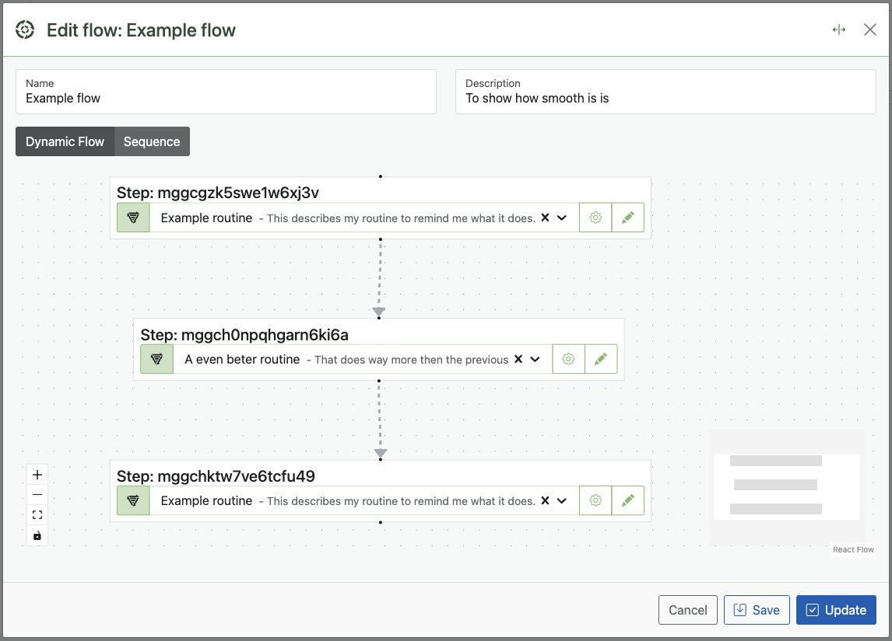

# Flows

**Flows** are the heart of SyncEngine automations.  
A flow defines how your data moves through a series of actions, known as Routines, to achieve a specific goal.

Flows bring structure, logic, and flexibility to your automations, allowing you to design complex processes in a clean and reusable way.

---

## What Is a Flow?

A **Flow** is a container that holds one or more **Routines**. Each routine contains a series of **Tasks** that perform actual operations.

Flows can be triggered by events, schedules, or manually, depending on how your automation is configured.

Think of a Flow as the “pipeline” through which your data travels, from input to output.

---

## Flow Structure



Flows execute routines **in sequence** by default, but advanced configurations allow you to run certain routines **in parallel** for better performance.

---

## Reusing Routines Across Flows

SyncEngine encourages reusability. You can use the same routine in multiple flows without duplicating configuration.  
This not only saves time but ensures consistency across automations.

Example:

- **Routine: Retrieve Orders** — gets all new orders from your database.
- **Routine: Send to ERP** — pushes the orders to your ERP system.
- Both routines can be reused in different flows for various automation goals.

---

## Flow Logic

Flows can include **conditional logic**, **loops**, and **branching** through tasks such as:

- `Choose` – Executes specific branches based on conditions.
- `Loop` – Repeats routines or tasks over datasets.
- `Trigger` – Starts other flows independently.

These control mechanisms make flows adaptable for any process, from simple synchronization tasks to complex multi-system orchestrations.

---

## Example Flow

**Use Case:** Sync product inventory between your online store and ERP system.

```
Flow: Sync Inventory
  ↓
  Routine: Retrieve Products
    └── Task: Retrieve (API → Shopify)
  Routine: Process Data
    ├── Task: Map (normalize structure)
    ├── Task: Filter (exclude archived)
    └── Task: Group (by SKU)
  Routine: Send to ERP
    └── Task: Send (ERP API)
```

In this flow:
- Each routine performs a distinct part of the process.
- Tasks transform and move data forward.
- SyncEngine logs every action for full transparency.

---

## Flow Configuration Options

| Setting | Description |
|----------|--------------|
| **Name** | The label for your flow, visible in the dashboard. |
| **Description** | Optional documentation for your flow’s purpose. |
| **Error Handling** | Choose whether the flow stops or continues when an error occurs. |
| **Logging Level** | Control how detailed logs are for this flow. |

---

## Debugging and Testing Flows

Use the **Preview Function** to test flows safely before activation.  
You can preview any routine or task and inspect the resulting data step by step.

> **Tip:** Use the `Trace` task inside routines to print debug information directly into the flow log.

---

## Best Practices

- Keep flows focused, one purpose per flow.
- Reuse routines across flows to avoid duplication.
- Use clear, descriptive names for each flow and routine.
- Always test new or modified flows in **Dry Run mode** before going live.

---

## Next Steps

- [Routines](routines.md) – Learn how routines organize tasks.
- [Automations](automations.md) – See how flows fit within the larger automation structure.
- [Tasks](tasks.md) – Explore the individual actions that make your flows work.

---

> **Note:** Flows are where your automation logic comes alive. The more modular your design, the easier it becomes to maintain and scale SyncEngine as your integration ecosystem grows.
